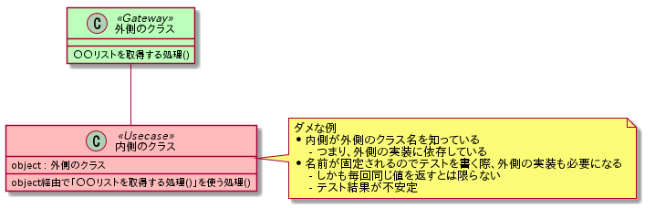
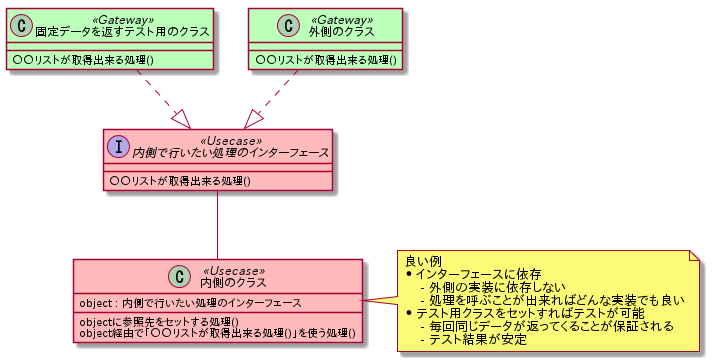

Clean Architecture UML Template
================================================================================

Clean Architecture で設計する際にUMLを書くためのテンプレートです。

UMLは [PlantUML](http://plantuml.com/) を使用して出力可能です。

テンプレートで出力した画像
--------------------------------------------------------------------------------

Clean Architecture について
--------------------------------------------------------------------------------

出典は[こちら](https://8thlight.com/blog/uncle-bob/2012/08/13/the-clean-architecture.html)から。

`内側に変化しにくいもの`、`外側に変化しやすいもの`を配置する構造です。  

もう少し具体的には  

* 外側(青色や緑色の層)
    - 使用するデータベースに関する処理やテーブルに格納するデータ構造
    - データの送受信やファイルI/Oなど他システムとの連携部分
    - 画面のレイアウトや操作方法などUI部分
    - 内側のデータを外側のデータに合致させるデータ変換処理
        - 外側のシステム等が変わればデータ構造も変わる可能性があるので外側に変換処理を置く
* 内側(赤色や黄色の層)
    - システムで解決する内容
        - そのシステムで何を管理し、何を処理するのか、といった根本部分
    - 根幹となるデータ構造

また、上記を踏まえた上で `自分より内側にあるものしか知らない` 様に実装を行う。  
※要するに `自分よりも外側にあるクラス名やモデル名などをコードの中に書かない`

もしも自分より外側に位置する処理を行いたい、といった場合には  
インターフェースで処理を定義し、その処理を実装した外側のクラスを注入することで  
処理を委譲する。  

以下に「ダメな実装」と「良い実装」を示す。  

  

  

